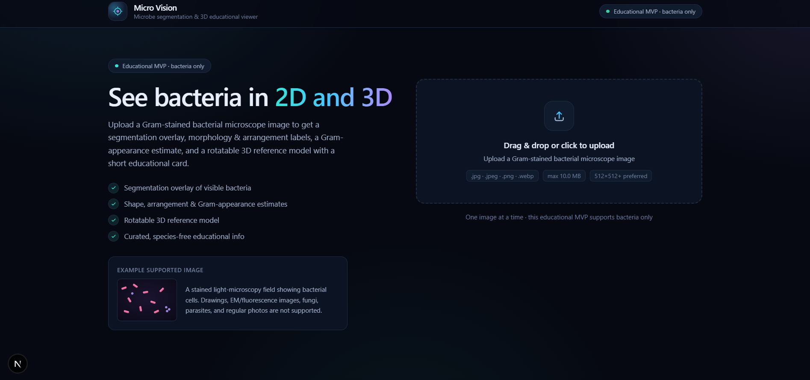
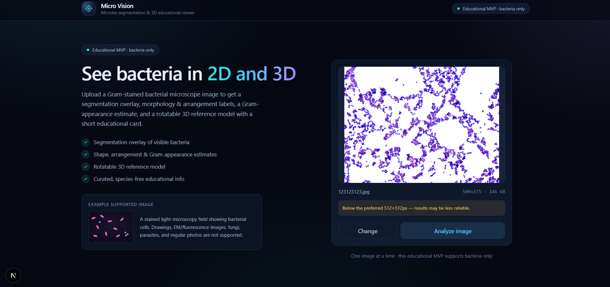
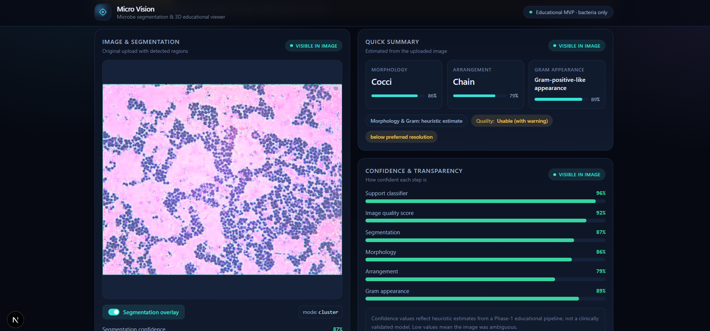
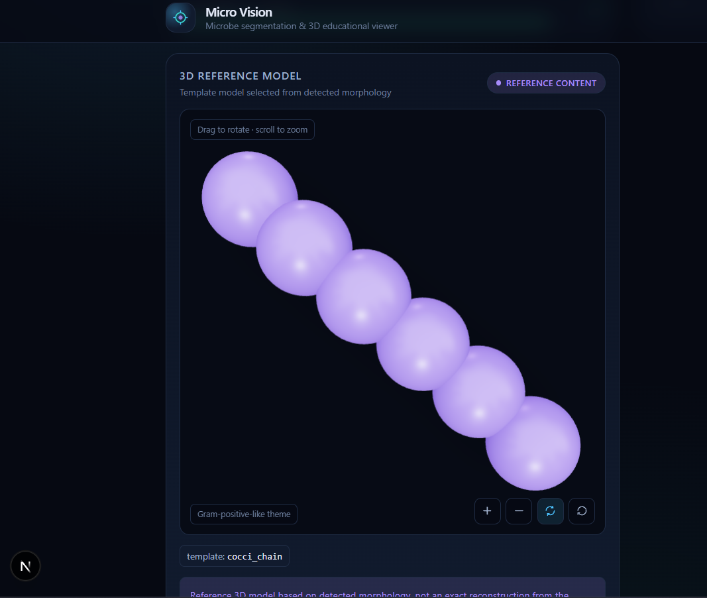

# Micro Vision

**Microbe segmentation & 3D educational viewer**

**Live demo:** [https://micro-vision-ten.vercel.app/](https://micro-vision-ten.vercel.app/)

Upload a Gram-stained bacterial microscope image and get a segmentation overlay, morphology / arrangement / Gram-appearance estimates, a rotatable 3D reference model, and a short educational card — all in one place.

> **Educational use only.** Micro Vision analyzes visible image features and shows a reference 3D model based on detected morphology. It does **not** provide species-level identification or medical diagnosis.

<p align="center">
  
</p>

<p align="center"><em>Home — upload a Gram-stained bacterial field to start analysis</em></p>

---

## What you get

| Feature | What it shows |
| --- | --- |
| **Segmentation overlay** | Highlights visible bacterial cells on your image |
| **Quick summary** | Morphology (e.g. cocci), arrangement (e.g. chain), and Gram-appearance estimate — each with confidence |
| **Confidence breakdown** | Per-stage scores so you can see how reliable the run looked |
| **3D reference model** | Rotatable template matched to the detected shape & arrangement |
| **Educational card** | Curated, species-free explanations — not an ID |

---

## Walkthrough

### 1. Upload an image

Drag & drop or click to upload a `.jpg`, `.png`, or `.webp` Gram-stained light-microscopy field (one image at a time; max 10 MB; 512×512+ preferred).

<p align="center">
  
</p>

<p align="center"><em>Preview your image, then hit Analyze</em></p>

**Supported:** stained light-microscopy fields showing bacterial cells.

**Not supported:** drawings, EM/fluorescence, fungi, parasites, or regular photos.

### 2. Review the 2D analysis

The results view shows your image with an optional segmentation overlay, a quick morphology / arrangement / Gram summary, and a transparent confidence breakdown for each pipeline stage.

<p align="center">
  
</p>

<p align="center"><em>Segmentation overlay + morphology, arrangement, and Gram estimates</em></p>

### 3. Explore the 3D reference model

A template model is selected from the detected morphology (for example `cocci_chain`). Drag to rotate, scroll to zoom. The color theme follows the Gram-appearance estimate.

<p align="center">
  
</p>

<p align="center"><em>Interactive 3D reference — not an exact reconstruction from the image</em></p>

---

## Getting started

```bash
npm install
npm run dev
# open http://localhost:3000
```

Optional: run the ML backend so morphology + Gram come from a trained model instead of heuristics (falls back automatically if the backend is offline). See [`ml/README.md`](ml/README.md).

```bash
# with the model server running on :8000
# set MICROVISION_MODEL_URL=http://127.0.0.1:8000
```

---

## How it works

```
Upload → compute image metrics (browser canvas)
      → POST /api/analyze
           ├─ optional ML backend (morphology + Gram)
           └─ heuristic pipeline (quality, arrangement, segmentation, …)
      → store result → /results/[jobId]
Results → overlay, summary, confidence, 3D model, educational card
```

### Pipeline modules (`lib/services/`)

| Module | Responsibility |
| --- | --- |
| `supportClassifier.ts` | Is this a supported Gram-stained field? |
| `qualityChecker.ts` | Blur / contrast / exposure / resolution checks |
| `inference.ts` | Morphology, arrangement, Gram appearance, segmentation |
| `modelClient.ts` | Optional call to the FastAPI ML backend |
| `templateSelector.ts` | Morphology + arrangement → 3D template; Gram → color theme |
| `formatter.ts` | Orchestrates the pipeline and builds the result |
| `jobStore.ts` | In-memory result store (clears on restart) |

Educational copy lives in `lib/content/education.ts` (static, no LLM).

### API

| Endpoint | Method | Purpose |
| --- | --- | --- |
| `/api/analyze` | POST | Run the pipeline, return a job id |
| `/api/results/{jobId}` | GET | Fetch a stored result |
| `/api/health` | GET | Liveness check |

---

## Tech stack

- **Next.js 16** (App Router) · **React 19** · **TypeScript**
- **Tailwind CSS v4**
- **three.js** + **@react-three/fiber** + **@react-three/drei** (3D viewer)
- Optional **FastAPI** + **PyTorch** model for morphology & Gram ([`ml/`](ml/), [`backend/`](backend/))

---

## Project structure

```
app/            routes (home, results, api)
components/     upload flow, results panels, 3D viewer
lib/            taxonomy, metrics, services, content, themes
docs/           screenshots for this README
ml/             training & model artifacts
backend/        FastAPI inference server
```

---

## Scope

| In scope | Out of scope |
| --- | --- |
| Gram-stained bacterial light-microscopy images | Viruses, fungi, parasites |
| One image at a time | Batch uploads, accounts |
| Morphology, arrangement, Gram-appearance estimates | Species ID, diagnosis |
| Reference 3D templates | Exact 3D reconstruction from the photo |
